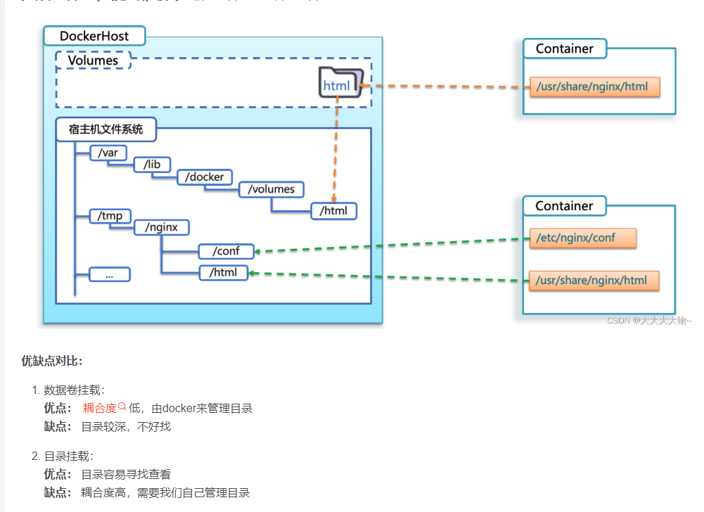

[docker好的视频](https://www.bilibili.com/video/BV1aA4m1w7Ew/?spm_id_from=333.880.my_history.page.click&vd_source=95ec760e1cb7245ba0252e9e0962b83f)
[docker文章 大汇总](https://linux.do/t/topic/17895)
[docker文章 对于镜像原理解析 很好](https://blog.csdn.net/PIKapikaaaa/article/details/131510452)
[docker 数据卷挂载和目录挂载](https://blog.csdn.net/qq_36515317/article/details/127987651)
bootfs： 包含bootloader（引导加载程序）和kernel（内核）
rootfs： root文件系统，包含的就是典型Linux系统中的 /dev，/ proc， /bin， /etc等标准目录和文件
不同的linux发行版，bootfs基本一样，儿rootfs不同，如ubuntu，centos等                        
docker镜像是由特殊的文件系统叠加而成的**【分层的文件系统】**
最底端是bootfs，并使用宿主机的bootfs
第二层是root文件系统rootfs，称为base image
然后网上可以叠加其它的镜像 镜像复用linux操作系统，只需root文件系统 且基础镜像可以复用包括rootfs


数据卷挂载（Volume Mount）：通过 docker run -v 或 Dockerfile 中的 VOLUME 指令挂载的数据卷内容不会被包含在新的镜像中。数据卷是一个持久化存储的机制，在容器之间共享数据，但不包含在镜像中。因此，当您使用 docker commit 命令创建新的镜像时，这些数据卷中的内容不会被包含在新的镜像中。
```bash
# 创建nginx容器并挂载数据卷到容器内的HTML目录
docker run --name mn -v html:/usr/share/nginx/html -p 80:80 -d nginx
# [数据卷名称]:[卷内目录，即容器的目录]
```
直接目录挂载（Bind Mount）：通过 docker run -v /host/path:/container/path 挂载的目录或文件会被包含在新的镜像中。这是因为直接目录挂载是将主机上的目录或文件直接挂载到容器中，它们的内容与主机上的内容是同步的。因此，当您使用 docker commit 命令创建新的镜像时，这些挂载的目录或文件中的内容会被包含在新的镜像中，**因为内容存储在宿主机的绝对目录下**。
```bash
# 直接目录挂载
docker run --name mn -v [宿主机目录]:[容器内目录]
docker run --name mn -v [宿主机文件]:[容器内文件]

```


