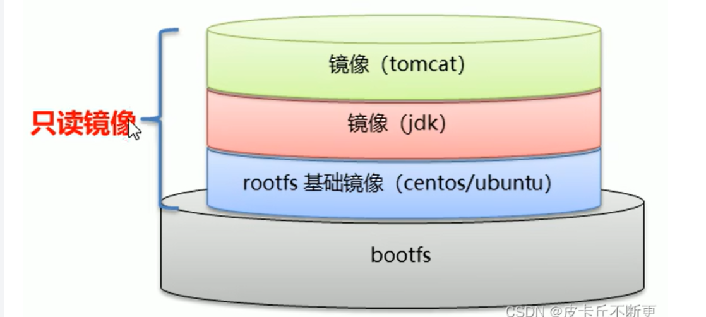
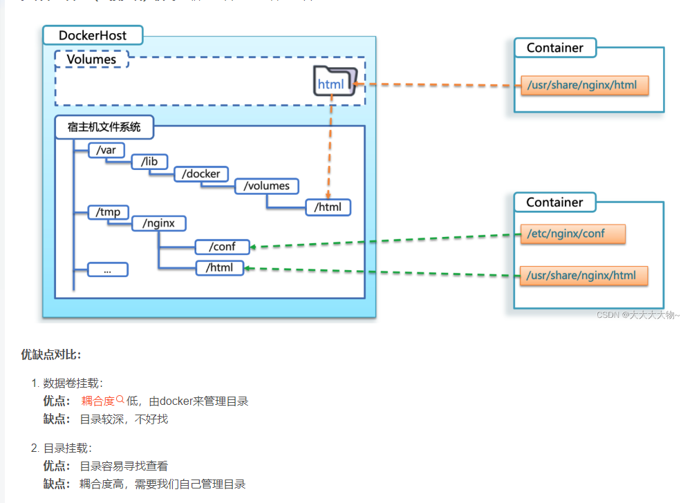

## Docker 学习资料推荐

- [Docker 好的视频（B站）](https://www.bilibili.com/video/BV1aA4m1w7Ew/?spm_id_from=333.880.my_history.page.click&vd_source=95ec760e1cb7245ba0252e9e0962b83f)
- [Docker 相关文章大汇总（Linux.do）](https://linux.do/t/topic/17895)
- [Docker 镜像原理解析（CSDN 博客）](https://blog.csdn.net/PIKapikaaaa/article/details/131510452)
- [Docker 数据卷挂载与目录挂载详解（CSDN 博客）](https://blog.csdn.net/qq_36515317/article/details/127987651)

---

## Docker 镜像基础概念整理

- **bootfs**：
  - 包含 bootloader（引导加载程序）和 kernel（内核）。
  - bootfs 主要负责系统的引导过程。
  - 不同 Linux 发行版的 bootfs 基本相同，通常直接使用宿主机的 bootfs。

- **rootfs**：
  - root 文件系统，包含典型 Linux 系统中的标准目录和文件，如 `/dev`、`/proc`、`/bin`、`/etc` 等。
  - 不同 Linux 发行版的 rootfs 内容不同，例如 Ubuntu、CentOS 的 rootfs 各自定制化。
  - 所以每个镜像都有独立的linux文件结构
  
---

### Docker 镜像结构特点

- Docker 镜像采用**分层文件系统（Layered Filesystem）**架构。
- 镜像最底层是 bootfs（通常直接复用宿主机的 bootfs）。
- 第二层是 rootfs（作为基础镜像 Base Image），包含了操作系统的文件系统。
- 在 rootfs 之上，可以叠加更多层，用于添加新的软件、配置和应用程序。
- **镜像复用机制**：
  - 多个镜像可以共享相同的基础层（比如同一个 rootfs），避免数据冗余。
  - 每一层都是只读的，只有容器运行时才叠加一个可写层（write layer）。

---

#### 🧱 只读镜像（Read-only Image）
定义：Docker 镜像本身是由多个“只读层”叠加组成的，每一层不可修改。

作用：包含操作系统、软件、依赖、应用代码等内容。

关键点：

多个容器可以基于同一个镜像创建，镜像不会变。

镜像是构建应用的基础模板。

📌 类比：就像一张只读的光盘或备份文件，谁都可以拿来用，但不能修改它本身。

#### ✍️ 可写层（Writable Layer）
* 定义：当你用镜像启动容器时，Docker 会在镜像顶层加一层可写层。

* 作用：记录容器运行时的所有文件修改、新建和删除。

* 生命周期：这个层属于容器本身，容器一删除，这层就没了。

📌 类比：你从“只读光盘”拷一份文件到桌面，然后你可以在桌面随意修改、写入、删除，但不会影响光盘原始内容，这样也保证不同容器不会冲突；容器就像镜像加载到内存的运行态，不同容器又是内存隔离的，但是磁盘上镜像是共用的。

🔁 两者的关系

| 类型         | 是否可写 | 生命周期         | 举例说明                     |
|--------------|----------|------------------|------------------------------|
| 镜像层       | ❌ 不可写 | 永久（镜像存在就在） | 系统文件、App 依赖、基础环境 |
| 容器可写层   | ✅ 可写   | 容器销毁即消失   | 日志、缓存、上传的文件等     |

#### 🧠 实际操作示例：镜像只读 + 容器可写层

你从 `nginx:latest` 镜像运行一个容器：

```bash
docker run -d --name web nginx:latest
```

nginx:latest 是只读的镜像；

容器层是可写层


{width=60% style="display: block; margin: 0 auto;"}


## 📦 Docker 中的数据卷挂载与直接目录挂载

### 1. 数据卷挂载（Volume Mount）

通过 `docker run -v` 命令或在 `Dockerfile` 中使用 `VOLUME` 指令挂载的数据卷，内容不会被包含在新的镜像中。

- **数据卷（Volume）** 是 Docker 提供的一种持久化存储机制。
- **特点**：
  - 用于在容器之间共享数据。
  - 不属于容器镜像的一部分。
  - 当使用 `docker commit` 创建新镜像时，数据卷中的内容不会被包含。
- **数据卷默认存储位置**：
  - `/var/lib/docker/volumes/`（在 Docker 虚拟机内部）。
  - `/var/lib` 是 Linux 系统中用于存放系统服务数据的标准路径。

#### 📌 示例

```bash
# 创建一个 Nginx 容器并挂载数据卷到容器内的 HTML 目录
docker run --name mn -v html:/usr/share/nginx/html -p 80:80 -d nginx
```

- 格式：`[数据卷名称]:[容器内部路径]`
- 示例中，将名为 `html` 的数据卷挂载到了 `/usr/share/nginx/html`。

---

### 2. 直接目录挂载（Bind Mount）

通过 `docker run -v /host/path:/container/path` 方式，将宿主机的**目录或文件**直接挂载到容器内。

- **特点**：
  - 容器访问的是宿主机实际存在的目录或文件，内容实时同步。
  - 如果使用 `docker commit` 创建新镜像，**绑定挂载的内容可能被包含到新镜像中**（前提是容器层中有内容修改）。
  - 绑定挂载依赖宿主机路径，不如数据卷灵活。

#### 📌 示例

```bash
# 绑定宿主机目录到容器内目录
docker run --name mn -v /path/on/host:/path/in/container

# 绑定宿主机文件到容器内文件
docker run --name mn -v /path/to/host/file:/path/to/container/file
```

- 格式：`[宿主机绝对路径]:[容器内部路径]`
- 注意：路径必须是宿主机上的绝对路径。

---

#### 3. 可视化示意图

<figure style="text-align: center;">
  
  <figcaption>橙色部分表示数据卷挂载；绿色部分表示直接目录挂载（Bind Mount）</figcaption>
</figure>

---

#### 4. 补充示意图

{width=100% style="display: block; margin: 0 auto;"}

---

#### 5. 总结对比表

| 特性               | 数据卷挂载（Volume Mount）            | 直接目录挂载（Bind Mount）        |
|---------------------|---------------------------------------|----------------------------------|
| 持久化位置         | Docker 管理的 `/var/lib/docker/volumes/` | 指定的宿主机绝对路径         |
| 容器间共享         | ✅ 支持                                | ✅ 支持                             |
| 是否包含在镜像中 | ❌ 不包含（`docker commit` 不保存） | ✅ 可能包含（如有修改）     |
| 可移植性           | ✅ 高                                   | ❌ 低（依赖宿主机路径）     |
| 适合场景           | 生产环境、持久化存储                   | 开发环境、实时同步调试         |

---


