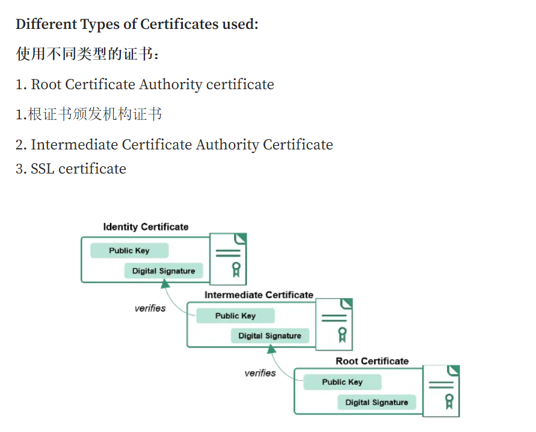
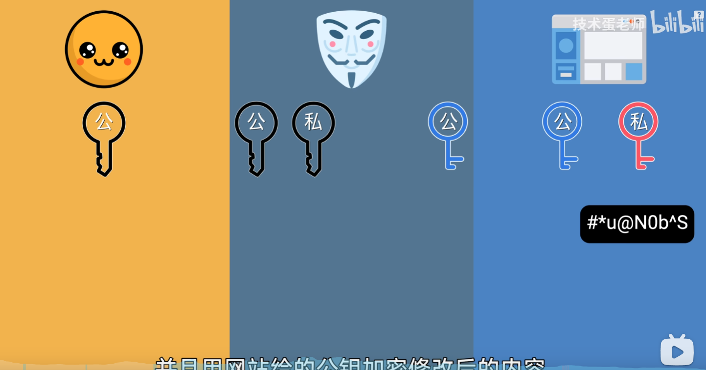
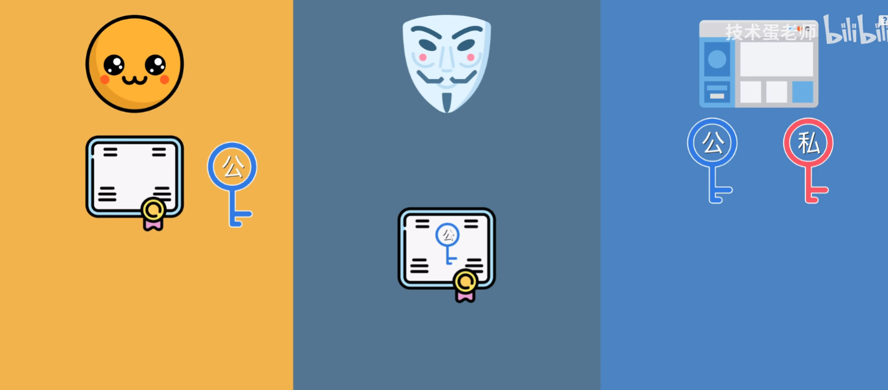
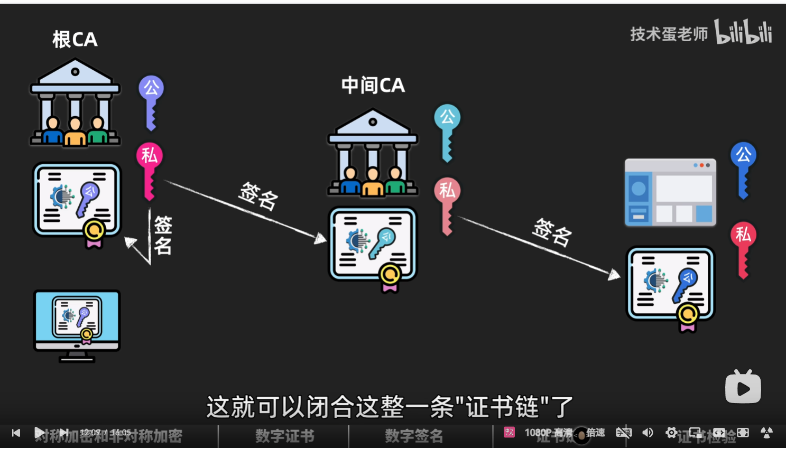
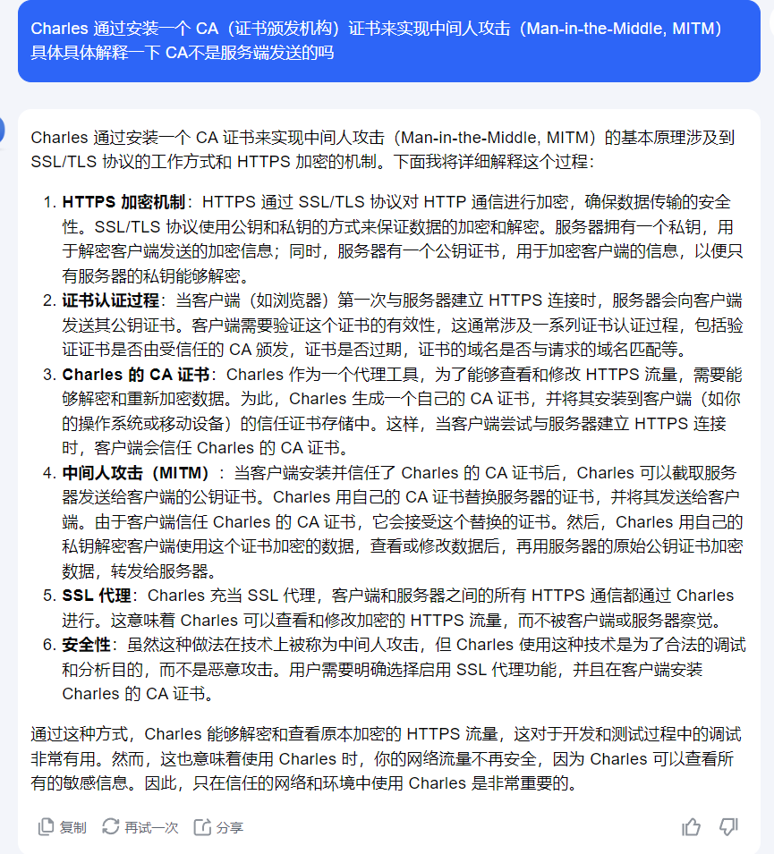

https://xie.infoq.cn/article/e021a8389f783e65d46149cc8
https://namangupta01.medium.com/how-ssl-works-23d8e5ed0cfa

ROOTCA,中间CA,SSL证书 都包括一个公钥和签名（签名由对应私钥签署，签名可以用公钥验证，公钥解开的hash值）

SSL就是非对称加密在身份认证中的应用；ROOTCA,中间CA，SSL证书构成的信任链提高了安全性

HTTPS 信息加密的过程是对称加密的 密钥由客户端随机生成，然后由SSL证书的公钥加密，服务器用自己的私钥解密后，用这个对称密钥加密信息进行传输
https://www.bilibili.com/video/BV1mj421d7VE/?spm_id_from=333.788&vd_source=95ec760e1cb7245ba0252e9e0962b83f
数字证书（带签名（对证书和要验证的公钥hash后用ca私钥加密的））和服务器公钥往往是一起发送的，数字证书的作用就是验证公钥是目的服务器发送的

根CA是去验证中间CA的公钥是中间CA的而不是中间人的，验证根ca的公钥是不是自己的是用是原本就安装在自己的计算机里的证书签发（该证书有根ca私钥签名后安装在本机）

客户端使用服务器公钥加密对称密钥的过程被Charles代理   客户端是使用的charles的证书

数字证书通常包含以下内容：

* 证书持有者的公开密钥。
* 证书持有者的身份信息（如姓名、组织、邮箱等）。
* 证书的序列号。
* 证书的有效时间。
* 证书颁发机构（CA）的名称。
；数字证书是证明公钥的真实性 类似于<公钥，域名>；数字证书中还有一个数字签名来证明它自身的真实性，通过证书CA提供的公钥解密出hash后对比证书信息hash是否一致

中间人攻击就是替换带掉服务端的公钥用自己生成的的公钥