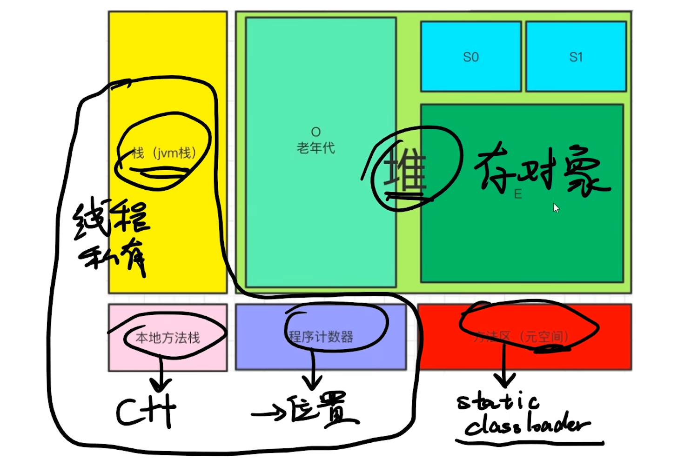
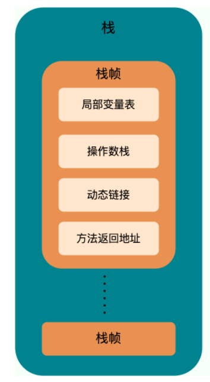
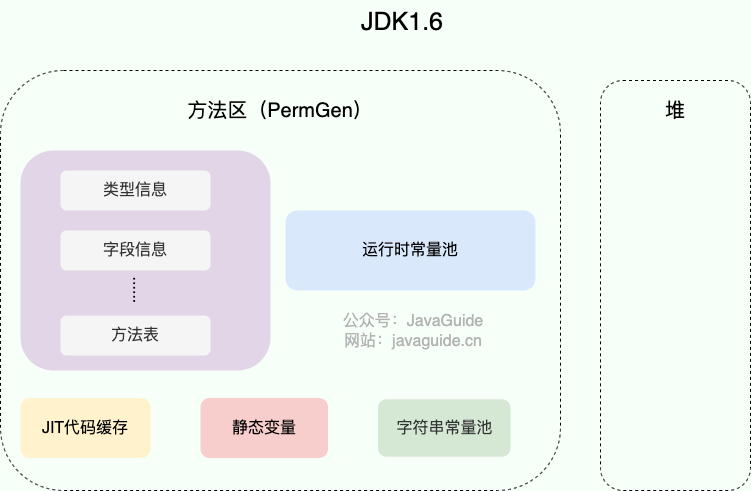
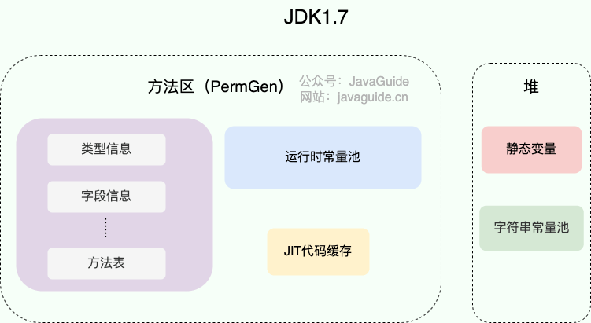

#### jvm内存分区

1. 堆区（线程共享） 存储java对象 
2. 栈区 （线程隔离）分为本地方法栈和虚拟机栈，两者分别为虚拟机执行java（字节码）方法和native方法服务
{width=60% style="display: block; margin: 0 auto;"
}
3. 方法区 （线程共享） 方法区存储虚拟加载的类信息、字段信息（字段的值在堆中的偏移等信息）、方法信息、常量、静态变量、即时编译器编译后的代码缓存等数据。字节码信息也存储在方法区。方法区在jdk1.8前的实现是永久代 1.8之后的实现是元实现

| 组成部分                                      | 说明                                                             |
|---------------------------------------------|------------------------------------------------------------------|
| ✅ **类的元信息（Class Metadata）**            | 类名、父类、接口、修饰符、类加载器等结构信息                           |
| ✅ **字段信息（Field Info）**                 | 所有成员变量的类型、修饰符等描述信息                                 |
| ✅ **方法信息（Method Info）**                | 所有方法的名称、参数、返回类型、修饰符、字节码、异常表等                 |
| ✅ **运行时常量池（Runtime Constant Pool）**   | 编译期产生的各种字面量（如字符串、数字）和符号引用（类、字段、方法名）        |
| ✅ **静态变量（Static Variables）**           | 类变量（带 `static` 修饰）在类加载时分配并存储在这里                    |
| ✅ **类构造器 `<clinit>` 方法信息**           | 用于初始化静态变量的特殊方法，也在方法区中                              |
| ✅ **方法字节码（Bytecode）**                 | 每个方法编译后的指令（供解释器或 JIT 编译器执行，在方法表中）                        |
| ✅ **注解与泛型信息（在运行时可反射）**        | 若保留了运行时可见性注解，会在方法区中保留其结构信息                    |

4. 运行时常量池 

    存放编译期生成的各种字面量（Literal）和符号引用（Symbolic Reference）的 常量池表(Constant Pool Table) 
    字面量包括整数、浮点数和字符串字面量。常见的符号引用包括类符号引用、字段符号引用、方法符号引用、接口方法符号。

下次再访问该字段时，直接用这份直接引用，无需再次解析。
5. 字符串常量池
字符串常量池 是 JVM 为了提升性能和减少内存消耗针对字符串（String 类）专门开辟的一块区域，主要目的是为了避免字符串的重复创建。JDK1.7 之前，字符串常量池存放在永久代。JDK1.7 字符串常量池和静态变量从永久代移动到了 Java 堆中。（Java 程序中通常会有大量的被创建的字符串等待回收，将字符串常量池放到堆中，能够更高效及时地回收字符串内存。）

6. 直接内存
通过 JNI 的方式在本地内存上分配的。通过DirectByteBuffer 对象作为这块内存的引用进行操作。这样就能在一些场景中显著提高性能，因为避免了在 Java 堆和 Native 堆之间来回复制数据。

#### 符号引用的解析 
 步骤 A：确定类
JVM 首先根据符号引用中的类名，去类加载器加载 com/example/Person 类，得到该类的 Class 对象。

如果类还没加载，触发加载、验证、准备、解析等过程。

步骤 B：确定字段
在类的 Class 对象中，查找该字段名和字段描述符完全匹配的字段符号。

如果找不到，抛出 NoSuchFieldError 异常。

如果找到，记录该字段在内存中对应的偏移量（field slot）或直接地址。

步骤 C：建立直接引用
JVM 将原先的符号引用替换为对该字段的直接引用（地址、偏移量等）通过obj地址拼接偏移量得到最终值。