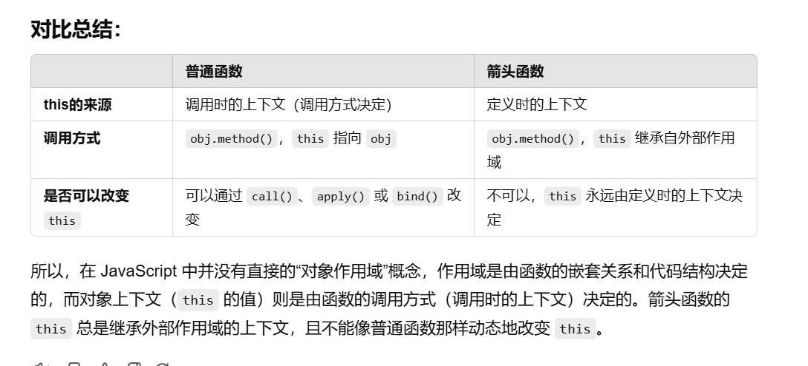

this指的是js方法执行的上下文，this 是执行上下文的一部分，它指向调用函数时的上下文对象，而不是函数对象本身。


    ```js
    //a. 作为对象的方法调用
      const person = {
  name: 'Alice',
  greet() {
    console.log(this.name);
  }
};
person.greet(); // 输出: Alice
  //b. 作为普通函数调用
    const greetFunction = person.greet;
greetFunction(); // 输出: undefined 或报错（在严格模式下）

//c. 使用 call、apply 或 bind 显式绑定 this
const anotherPerson = { name: 'Bob' };
person.greet.call(anotherPerson); // 输出: Bob

    ```


在对象字面量中，this 并不指向正在定义的对象本身，而是指向外部的执行上下文（如全局对象或调用它的函数的 this）。
因此，直接在对象字面量的属性中使用 this 可能导致意外结果

https://www.freecodecamp.org/news/the-this-keyword-in-javascript/


在 JavaScript 中，全局作用域 是指没有在任何函数或块级作用域内定义的地方。简而言之，位于代码文件的最外层或顶层的内容。
当你定义一个箭头函数时，如果这个箭头函数没有在任何特定的函数内部被定义，那么它就会在全局作用域中定义。
由于箭头函数 继承 它定义时的上下文的 this，如果它是在全局作用域中定义的，它的 this 就指向全局对象。
作用域和对像上下文有区别
https://chatgpt.com/share/672b6d4d-c794-800c-9c77-d4fec47e3869

