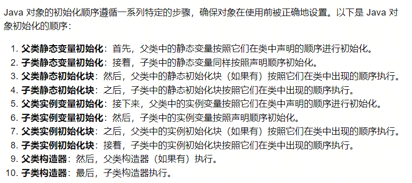

### 初始化顺序

### 使用初始化块的目的
直接初始化对象和使用初始化块初始化确实都可以达到初始化对象的目的，但它们之间存在一些关键的区别，这些区别决定了它们在不同场景下的适用性。以下是设计初始化块的几个原因：

1. **复杂初始化逻辑**：
   - 初始化块允许执行更复杂的初始化逻辑，比如需要多步操作或者需要调用其他方法才能正确初始化的情况。

2. **条件判断**：
   - 有时候，初始化可能依赖于某些条件。初始化块可以在运行时根据条件执行不同的初始化代码。

3. **资源分配**：
   - 对于需要分配资源（如文件句柄、数据库连接等）的初始化，使用初始化块可以确保每次创建对象时都进行资源分配，而直接初始化则通常只适用于不需要运行时信息的静态初始化。

4. **封装**：
   - 初始化块提供了一种封装初始化细节的方式，使得类的用户不需要知道具体的初始化过程。

5. **对象状态的一致性**：
   - 使用初始化块可以保证对象的状态在构造函数中被设置，这有助于保持对象状态的一致性。

6. **多态性**：
   - 初始化块中的代码可以利用多态性，调用父类或接口中定义的方法，这些方法可能在子类中有重写实现。

7. **延迟初始化**：
   - 有时候，对象的某些属性可能依赖于其他属性的值，或者只有在对象的构造过程中才能确定。初始化块允许将这些依赖关系封装起来。

8. **初始化顺序**：
   - 在类中，初始化块可以按照特定的顺序执行，而不受变量声明顺序的限制。

9. **构造函数参数的利用**：
   - 初始化块可以利用构造函数传入的参数来初始化对象，而直接初始化则不能。

10. **异常处理**：
    - 在初始化块中，可以包含异常处理逻辑，对可能出现的异常情况进行捕获和处理。

11. **代码组织**：
    - 使用初始化块可以使代码更加清晰和有组织，特别是在类有很多初始化代码时，可以避免构造函数变得过于复杂。

12. **与继承和多态的交互**：
    - 在继承的情况下，初始化块可以确保子类对象在调用父类的构造函数之后、子类构造函数之前进行初始化。

尽管直接初始化简单且直接，但初始化块提供了更多的灵活性和控制，允许开发者根据需要编写更复杂、更灵活的初始化代码。这使得初始化块成为 Java 对象初始化中不可或缺的一部分。