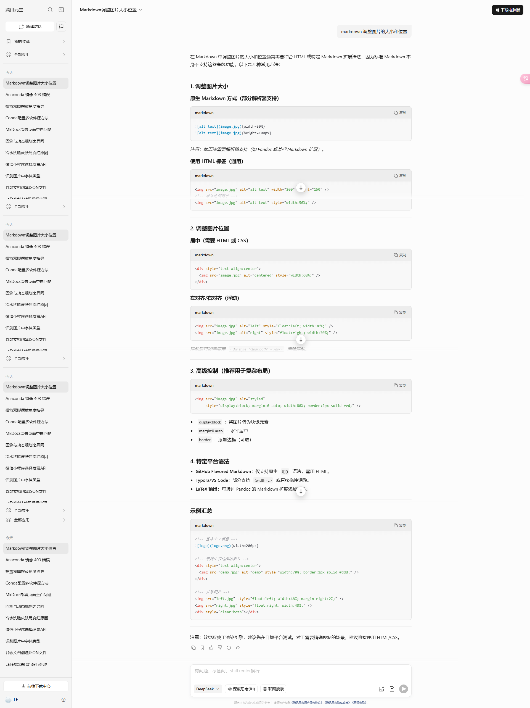

1. 标题：使用 `#` 符号表示标题，可使用不同数量的 `#` 表示不同级别的标题，最多支持六级标题。
    
    ```shell
    # 标题1
    ## 标题2
    ### 标题3
    ```
    
2. 列表：使用 `-` 或 `*` 符号表示无序列表，使用数字加 `.` 表示有序列表。
    
    ```markdown
    - 无序列表项1
    - 无序列表项2
    
    1. 有序列表项1
    2. 有序列表项2
    ```
    
3. 引用：使用 `>` 符号表示引用。
    
    ```markdown
    > 这是一个引用。
    ```
    
4. 粗体和斜体：使用 `**` 表示粗体，使用 `*` 或 `_` 表示斜体。
    
    ```markdown
    **粗体**，*斜体*，_也是斜体_
    ```
    
5. 链接和图片：使用 `[链接文字](链接地址)` 表示链接，使用 `` 表示图片。
    
    ```less
    [百度](https://www.baidu.com)
    
    ```
    
6. 代码块：使用三个反引号 ``` 表示代码块，可指定语言以进行语法高亮。
    
    ```java
    public class HelloWorld {
        public static void main(String[] args) {
            System.out.println("Hello, World!");
        }
    }
    ```
    
7. 水平线：使用三个或更多的 `-`、`*` 或 `_` 符号表示水平线。
    
    ```yaml
    ---
    ```
    

以上是 Markdown 的一些基本语法，你可以通过这些语法快速轻松地创建格式化的文档。


8. 实现按钮会执行终端脚本的按钮[](bash_script.sh){width=5%}

