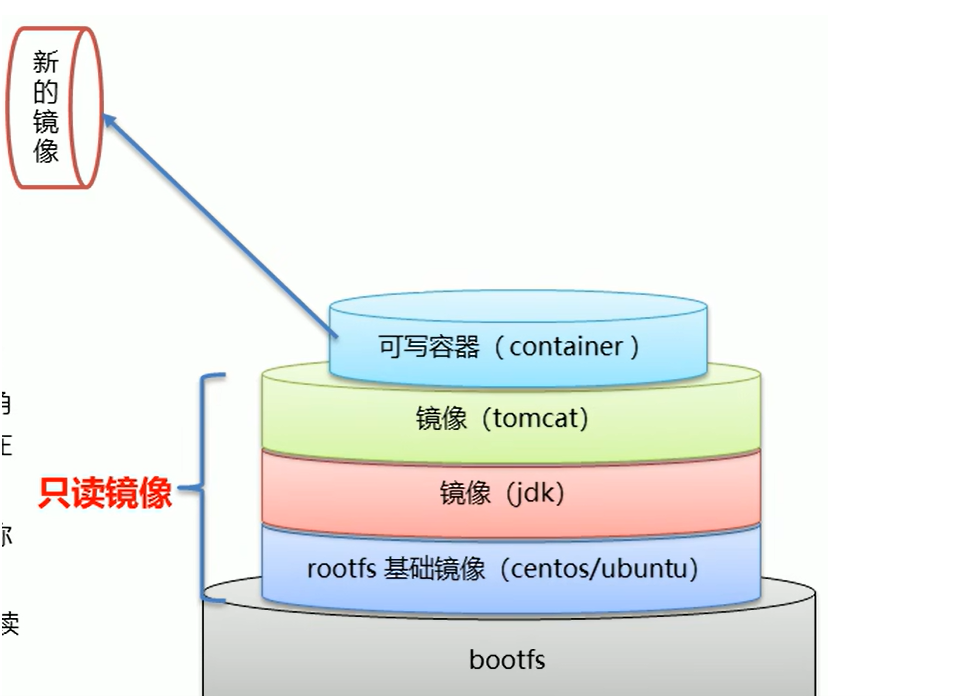

**ChatGPT:**

文本文件和二进制文件是两种不同的文件类型，它们在存储和处理方式上有一些重要的区别。

1. **文本文件**：
    
    * 文本文件是由字符组成的文件，其中的字符通常是按照某种编码（如ASCII、UTF-8等）来表示的。
    * 文本文件中的数据通常是以人类可读的形式存在，比如纯文本、源代码、配置文件等。
    * 文本文件的内容可以直接被文本编辑器或终端程序打开并阅读，例如Notepad、Sublime Text、Vim等。
    * 文本文件的内容通常以行为单位进行组织，每行末尾通常有一个换行符来表示行结束。
2. **二进制文件**：
    
    * 二进制文件是由二进制数据组成的文件，其中的数据并不是按照人类可读的方式表示的，而是以字节的形式存储。
    * 二进制文件的内容可能包括图像、音频、视频、可执行文件、压缩文件等，它们都是以二进制形式存储的，无法直接用文本编辑器打开并理解其内容。
    * 二进制文件中的数据通常是按照程序的特定格式来组织和解析的，通常需要专门的程序来打开和处理。

主要区别总结如下：

* 存储方式：文本文件中的数据以字符形式存储，而二进制文件中的数据以字节形式存储。
* 可读性：文本文件通常是人类可读的，而二进制文件通常是机器可读的。
* 内容类型：文本文件包含文本数据，而二进制文件可以包含各种类型的数据，如图像、音频、视频等。
* 打开方式：文本文件可以用文本编辑器直接打开，而二进制文件通常需要特定的程序来打开和处理。

总之，文本文件和二进制文件在数据组织方式、内容类型和打开方式等方面有所不同，因此在处理和存储时需要加以区分。

 此时此刻是啊出门那是开车