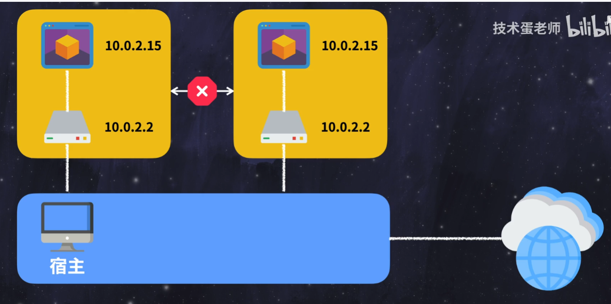
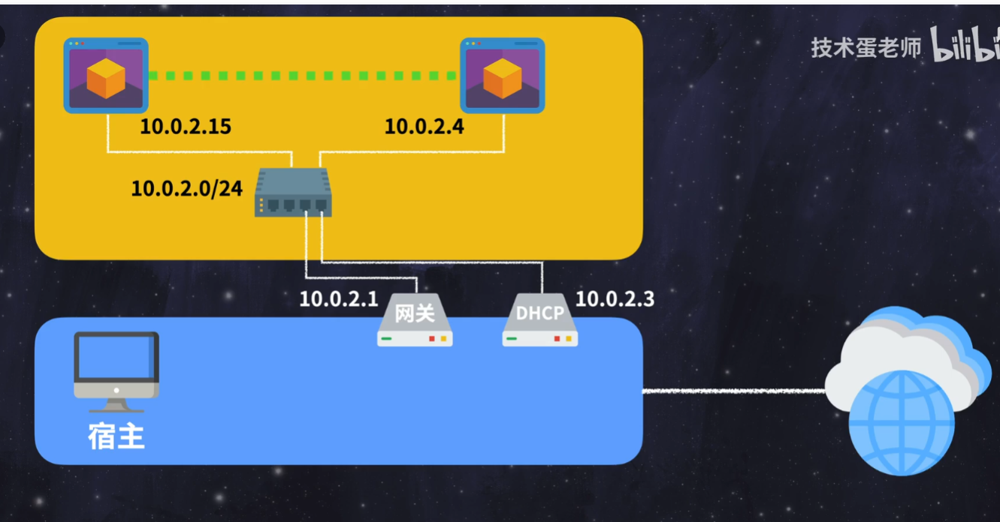
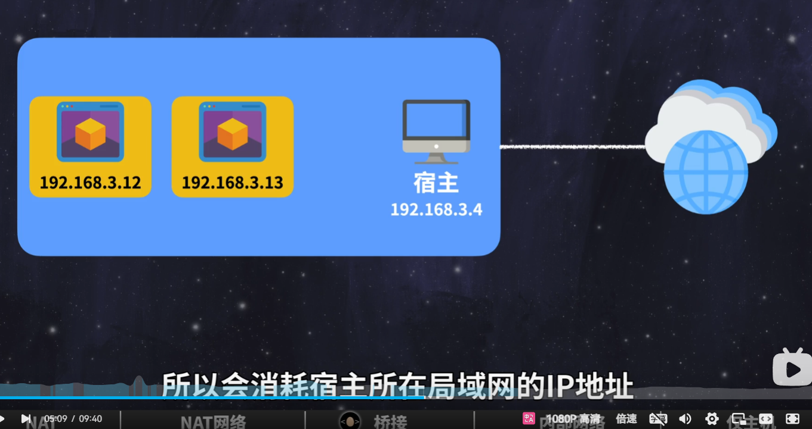
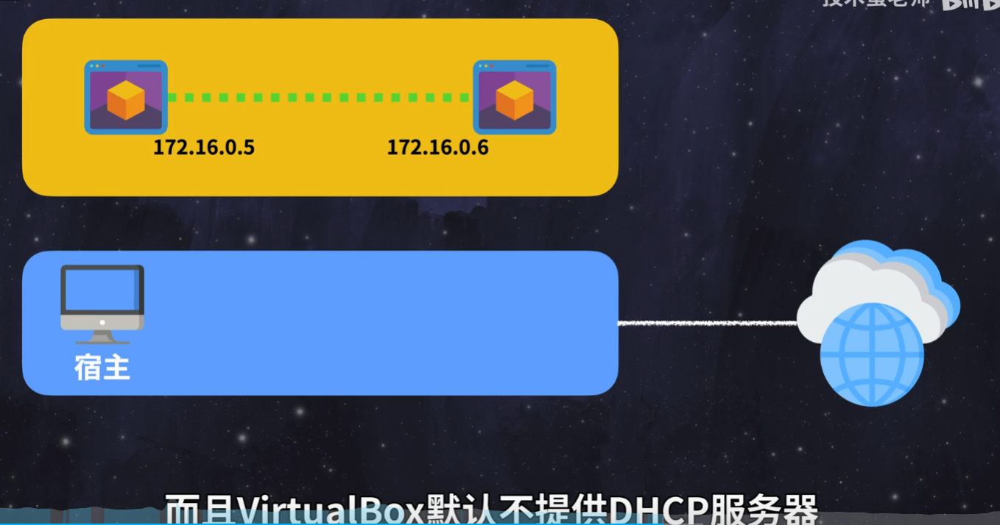
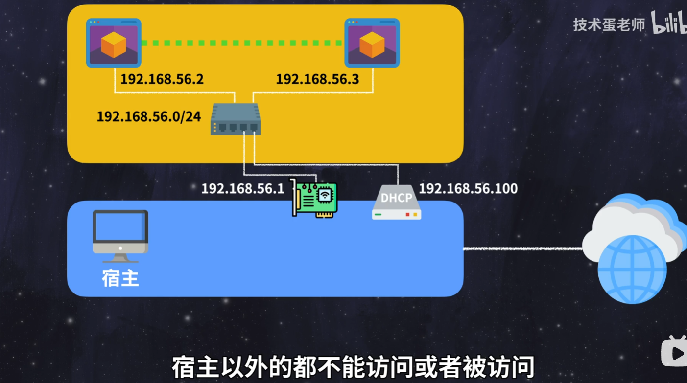
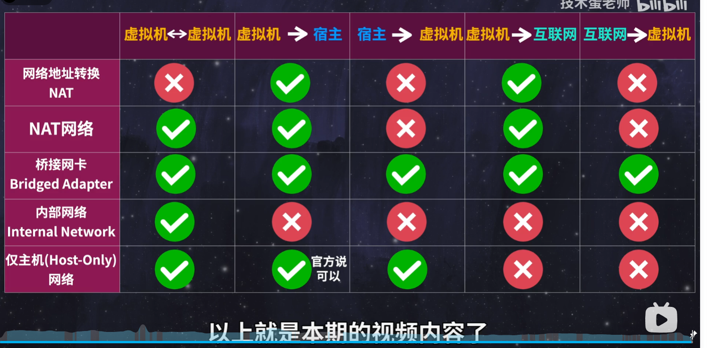

# VMware 虚拟网络模式总结

## 🧱 VMware 虚拟网络模式总结（类比物理网络结构）

### 1. NAT模式（虚拟路由 + AP隔离）

- **拓扑模型**：主机虚拟了一个 **路由器**，WAN口连接主机物理网络，LAN口连接虚拟机。
- **网络行为**：
  - 虚拟机访问外网通过主机 NAT 转发。
  - VMware 分配虚拟网卡（如 `VMnet8`）接入 LAN。
- **互访说明**：
  - 虚拟机是否能互相访问，取决于是否连接同一虚拟路由 + 是否启用 AP隔离。
- **常见用途**：虚拟机需要上网但不暴露在真实局域网中。

### 2. 桥接模式（虚拟交换机）

- **拓扑模型**：主机虚拟了一个 **交换机**，主机和虚拟机都接入物理网络。
- **网络行为**：
  - 虚拟机拥有独立 IP，出现在物理网络中。
- **互访说明**：
  - 虚拟机 ↔ 主机 ↔ 外部设备自由通信。
- **常见用途**：需要公网通信或真实局域网互通。

### 3. 仅主机模式（虚拟交换机 + 主机参与）

- **拓扑模型**：主机虚拟了一个交换机（如 VMnet1），主机和虚拟机都接入。
- **网络行为**：
  - 虚拟机与主机通信，无外网。
- **互访说明**：
  - 虚拟机之间、与主机均可通信。
- **常见用途**：测试局域网通信或开发环境。

### 4. 内部网络模式（隔离交换机）

- **拓扑模型**：主机虚拟一个只连接虚拟机的交换机，主机不参与。
- **网络行为**：
  - 虚拟机之间互通，无外部访问。
- **常见用途**：病毒传播测试、完全封闭实验网络。

---

## 🧾 VMware 虚拟网络模式通信能力对比表

| 网络模式                     | 虚拟机 ↔ 虚拟机 | 虚拟机 → 宿主机 | 宿主机 → 虚拟机 | 虚拟机 → 外网 | 外网 → 虚拟机 |
| ---------------------------- | --------------- | --------------- | --------------- | ------------- | ------------- |
| NAT模式（地址转换）          | ❌（通常被隔离） | ✅               | ❌               | ✅             | ❌             |
| NAT网络（同一段）            | ✅               | ✅               | ✅               | ✅             | ❌             |
| 桥接网络（Bridged Adapter）  | ✅               | ✅               | ✅               | ✅             | ✅             |
| 内部网络（Internal Network） | ✅               | ❌               | ❌               | ❌             | ❌             |
| 仅主机网络（Host-Only）      | ✅               | ✅（官方说支持） | ✅               | ❌             | ❌             |

