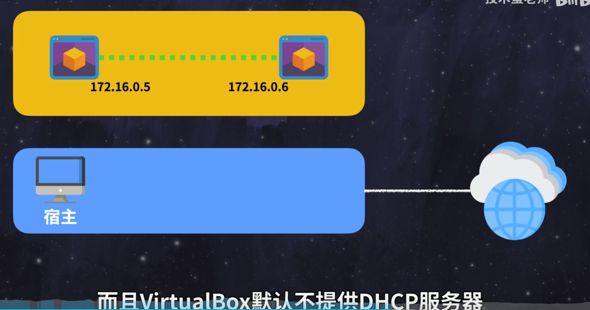

把虚拟机当成物理机的网络拓扑来看，会好理解点
nat是主机虚拟了一个/多个路由器，并将网络共享给了wan口，lan口下面接了虚拟机，虚拟机之间能不能互访就看接的是不是同一个虚拟路由，这个路由做了ap隔离没有，不是同一个虚拟路由或者做了ap隔离都会导致无法互访，其他虚拟机我不清楚，vmware的话，还会虚拟一个网卡给再连上这个虚拟路由的lan口
桥接是主机在自己上面虚拟出来一个交换机，并且与主机相连，也与其他虚拟机相连，大家都是同级，互访自然方便
内部网络是主机虚拟出来一个交换机，不和主机相连，模拟最原始的网络模型，不会影响到外面的设备，用来测会通过网络传播的病毒挺合适
仅主机是主机虚拟出来一个没接wan口的路由器，设备都插在lan口上，不过主机用的是虚拟网卡来接的，自然是虚拟设备可以访问主机上这个虚拟网卡获取到的ip，但是访问不了主机物理网卡在上级路由获取到的ip
所以vmware安装后会在任务管理器多出来两个虚拟网卡

